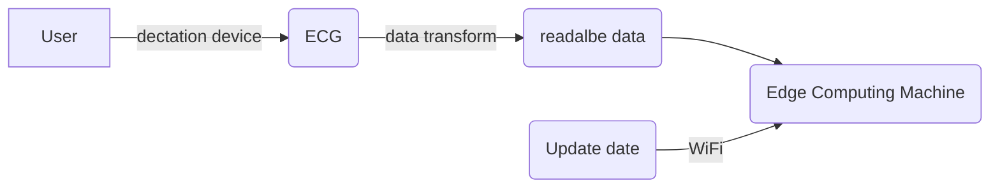

# ECP_data_analyse
trasform a immediate input data to machine and transform to readable data

# Architecture

```mermaid
flowchart LR
    U[User]-- dectation device--> Es(ECG)--data transform
    -->RD(readalbe data) -->ECM(Edge Computing Machine)

    UDD(Update date) -- WiFi -->ECM
```
